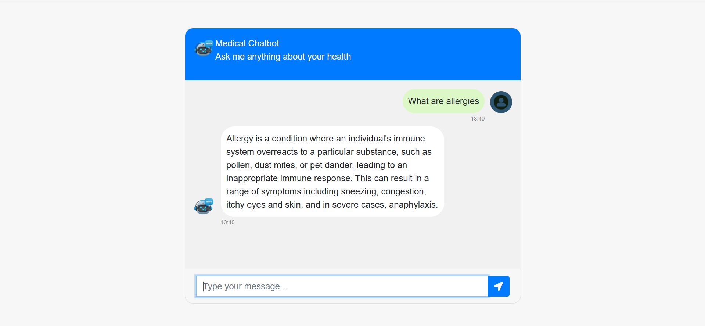

# 🏥 Medical Chatbot using LLaMA 2

A context-aware medical chatbot powered by **Meta's LLaMA 2** and integrated with **LangChain**, **Pinecone**, and **Flask**. This bot can retrieve relevant medical information and provide meaningful responses using a quantized LLaMA 2 model and vector-based search.

---

## 📁 Project Structure
📦 medical-chatbot/

├── .vscode/

├── data/

├── experiment/

├── logs/

├── mchatbot/

├── model/

├── ProjectImage/

├── src/

├── static/

├── templates/

├── venv/

├── .env

├── .gitignore

├── app.py

├── store_index.py

├── requirements.txt

├── setup.py

├── README.md

└── Medical_Chatbot.egg-info/

---

## 🚀 Getting Started

### 1. 📦 Create a Virtual Environment

```bash
conda create -p venv python=3.8 -y

2. ✅ Activate the Environment

```bash
conda activate venv

```

3. 📥 Install Required Packages

```bash
pip install -r requirements.txt

```

🔐 Environment Variables
Create a .env file in the root directory and add your Pinecone API key:

```ini
PINECONE_API_KEY='your_pinecone_api_key_here'
```

🤖 Download LLaMA 2 Model

Download the quantized model llama-2-7b-chat.ggmlv3.q4_0.bin from:

🔗 Hugging Face – TheBloke/Llama-2-7B-Chat-GGML

Place the model file in the appropriate directory used in your code.


🧠 Index Medical Knowledge
Use the following command to embed and store data into Pinecone:

```bash
python store_index.py
```

💬 Run the Chatbot
Launch the Flask server:
```bash
python app.py
```

Open your browser and go to:

```bash
http://localhost:
```


### 🛠 Tech Stack
Python 3.8

Flask – Web framework

LangChain – Orchestration framework

Meta LLaMA 2 – Foundational language model

Pinecone – Vector database for semantic search

Hugging Face Transformers – Model integration


### 📸 Screenshots



### 🧪 Future Improvements
UI enhancements using React/Next.js

Integration with voice input/output

Fine-tuning on domain-specific datasets

Cloud deployment (AWS, Azure, GCP)


### 👩‍💻 Author

KANISHKA RANI

Computer Science Engineering | AI/ML Enthusiast